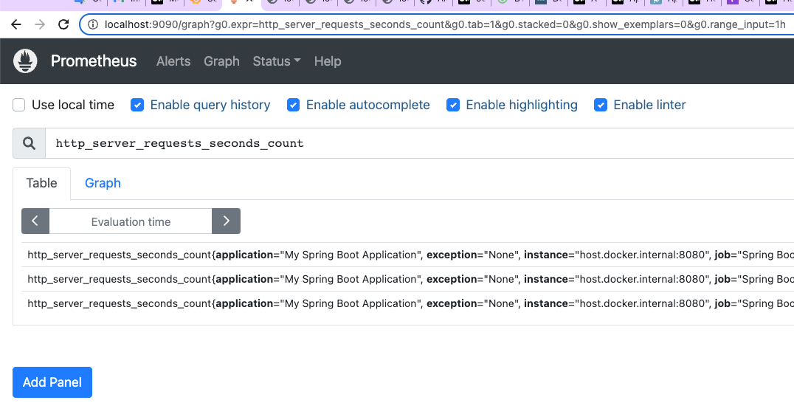
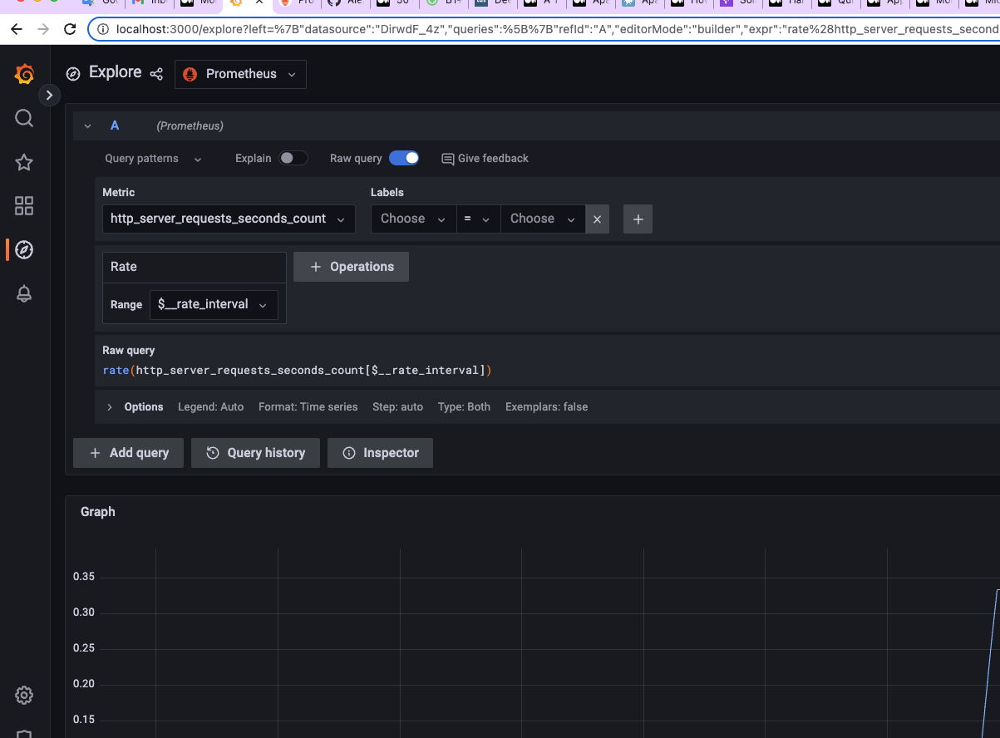
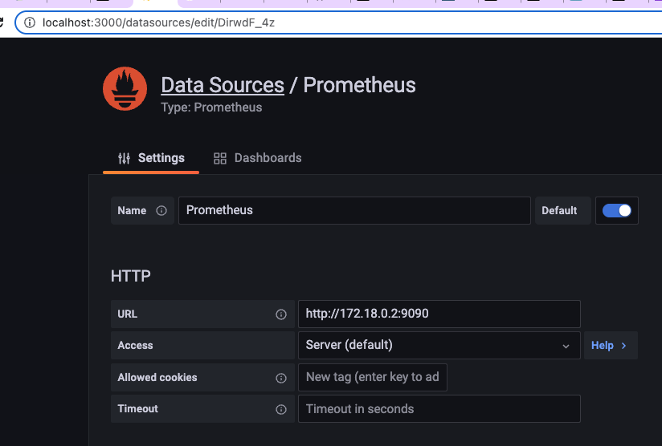

# springboot-monitoring-demo
Demo app showing how to configure Actuator, Prometheus, and Grafana

This repository is a demo for my article on medium.com:

https://betterprogramming.pub/how-to-monitor-a-spring-boot-app-with-prometheus-and-grafana-22e2338f97fc

## Steps to run
1. Run docker-compose from intelliJ IDEA
2. Prometheus and Grafana are started as docker containers
3. Create Prometheus Data Source in Grafana
4. Run DemoApplication SpringBoot App
5. Trigger actuator endpoints
   * http://localhost:8080/actuator
   * http://localhost:8080/actuator/prometheus
   * http://localhost:8080/actuator/health
   * http://localhost:8080/actuator/metrics
6. Check Prometheus ``http_server_requests_seconds_count`` metric

7. Explore Prometheus Data Source


## Prometheus UI
* http://localhost:9090/

## Grafana UI
* http://localhost:3000/

## Notes
### prometheus.yaml
Scrape metrics from local running app
``host.docker.internal``
https://docs.docker.com/desktop/networking/#i-want-to-connect-from-a-container-to-a-service-on-the-host

### Configure Prometheus Data Source
How to get the IP Address of Prometheus Container (that is running as Docker)
```shell
docker ps
```
``docker ps ``
Get container id ({container_id}) from response
```shell
docker container inspect {container_id}
```

At the bottom in Networks -> IPAddress find IP Address

```json
"Networks": {
                "monitoring_default": {
                    "IPAMConfig": null,
                    "Links": null,
                    "Aliases": [
                        "prometheus-container",
                        "prometheus",
                        "38e1bd28b59e"
                    ],
                    "NetworkID": "82e82c975fdc1656819a27ce0a69dd401396c7ac0f585efffd36fcd7fb2f3b3c",
                    "EndpointID": "27b0a4c12cf20d57284879f071aab90b858ca7da1f00a95c4bc7d4db28893113",
                    "Gateway": "172.18.0.1",
                    "IPAddress": "172.18.0.2",
                    "IPPrefixLen": 16,
                    "IPv6Gateway": "",
                    "GlobalIPv6Address": "",
                    "GlobalIPv6PrefixLen": 0,
                    "MacAddress": "02:42:ac:12:00:02",
                    "DriverOpts": null
                }
            }

```




